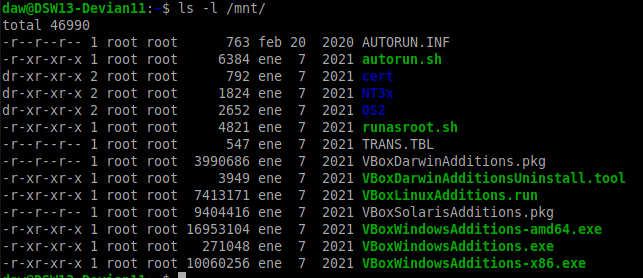

# Instalar Guest Additions en Debian 11

Para instalar las guest additions en Debina primero insertamos el ISO de esta en un disco virtual. 

Luego de este en nuestra maquina montamos el disco.

```
sudo mount /dev/cdrom /mnt
```

Vemos el contenido con 
```
ls -l /mnt
```

Deberia mostrarnos algo como lo siguiente.



# Requisitos.
Con esto realizado vamos a actualizar nuestra maquina asi como lo lista de los repositorios de Debian.

```
sudo apt update && sudo apt upgrade
```

# Instalación.
Ya con lo demas realizado podemos instalar la Guest Additionas ejecutando el siguiente comando.

```
sudo sh /mnt/VBoxLinuxAdditions.run
```

Y luego reiniciamos la maquina.
```
sudo reboot
```